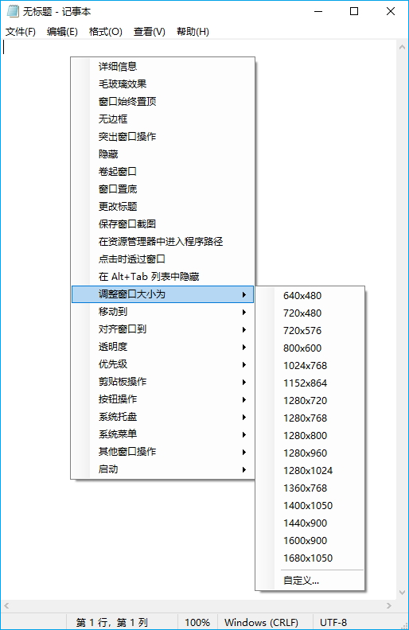
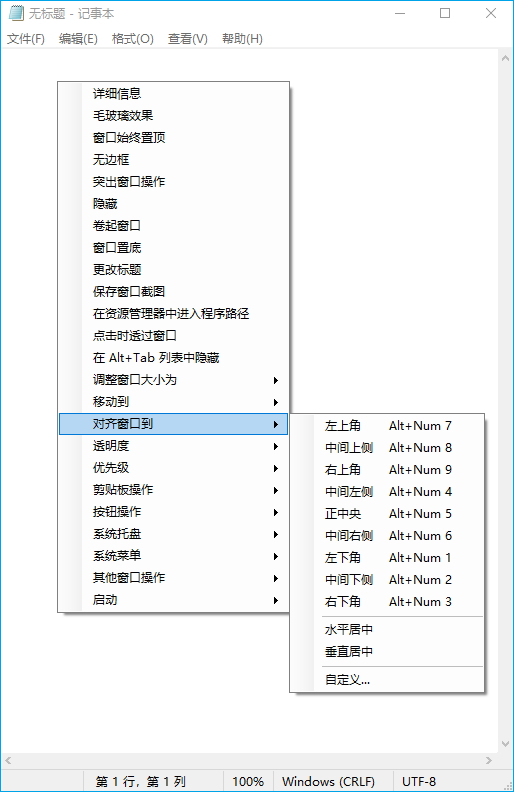

<div align="center">


# SmartContextMenu

</div>

🌏: [English](/) [Русский](/README_RU.md) [**中文版**](/README_CN.md) [한국어](/README_KO.md)

---

SmartContextMenu为您的操作系统的所有窗口添加了一个上下文菜单。该程序是SmartSystemMenu的改进版，希望它更加方便使用，因为它支持所有窗口的操作，包括没有系统菜单的窗口。此外，它更加稳定且轻量，因为它不使用独立DLL模块的hooks。要使用该应用程序，需要启动SmartContextMenu.exe文件，将鼠标光标移到需要的窗口上，并使用“Ctrl + 右键单击”的快捷键。所有菜单设置和快捷键可以在系统托盘中的应用程序界面中更改，也可以在SmartContextMenu.xml文件中进行修改。可用的菜单项包括：


* **详细信息.** 显示一个对话框，其中包含当前窗口和进程的信息：窗口句柄、窗口标题、窗口风格、窗口类、进程名称、进程ID、进程路径。
* **隐藏.** 允许隐藏当前窗口。
* **卷起窗口.** 将当前窗口向上卷起。
* **无边框.** 允许将窗口显示为无边框模式，适用于窗口化的游戏。
* **毛玻璃效果.** 将 "毛玻璃效果" 模糊添加到当前窗口。(仅 Windows Vista 及更高版本支持。主要用于控制台窗口。)
* **窗口始终置顶.** 将当前窗口保持在所有其他窗口之上。
* **更改图标.** 允许更改当前窗口的图标。
* **更改标题.** 允许更改当前窗口的标题。
* **窗口置底.** 将当前窗口保持在所有其他窗口之下。
* **保存窗口截图.** 将当前窗口的屏幕截图保存到文件中。
* **在资源管理器中进入程序路径.** 在文件资源管理器中打开进程文件。
* **通过鼠标拖动.** 允许通过鼠标拖动当前窗口。
* **点击时穿过窗口.** 允许点击穿透当前窗口。
* **在 Alt+Tab 列表中隐藏.** 允许当前窗口在任务栏和 Alt+Tab 切换中隐藏。
* **调整窗口大小到.** 更改当前窗口的大小。
* **移动到.** 将当前窗口移动到另一个显示器。
* **对齐窗口到.** 当前窗口与桌面上的9个位置中的任何一个对齐。
* **透明度.** 更改当前窗口的透明度。
* **优先级.** 更改当前窗口的程序优先级。
* **剪贴板操作.** 复制所有窗口文本 (包括控制台、MS Office 产品等) 到剪贴板中，同时支持清除剪贴板。
* **突出窗口操作.** 使除当前焦点窗口之外的所有窗口变暗。
* **按钮操作.** 允许禁用 "最小化" 、 "最大化" 和 "关闭" 按钮。
* **系统托盘.** 将当前窗口最小化或挂起到系统托盘。
* **系统菜单.** 含有系统菜单各项内容。
* **其他窗口操作.** 关闭和最小化系统中除当前窗口之外的所有窗口。
* **启动.** 启动设置中的程序。

截图
------------------





## 命令行接口

```bash
   --help             The help
   --title            Title
   --titleBegins      Title begins 
   --titleEnds        Title ends
   --titleContains    Title contains
   --handle           Handle (1234567890) (0xFFFFFF)
   --processId        PID (1234567890)
-d --delay            Delay in milliseconds
-l --left             Left
-t --top              Top
-w --width            Width
-h --height           Height
-i --information      Information dialog
-s --savescreenshot   Save Screenshot
-m --monitor          [0, 1, 2, 3, ...]
-a --alignment        [topleft,
                       topcenter,
                       topright,
                       middleleft,
                       middlecenter,
                       middleright,
                       bottomleft,
                       bottomcenter,
                       bottomright,
                       centerhorizontally,
                       centervertically]
-p --priority         [realtime,
                       high,
                       abovenormal,
                       normal,
                       belownormal,
                       idle]
   --systemmenu       [restore,
                       minimize,
                       maximize,
                       close]
   --transparency     [0 ... 100]
   --alwaysontop      [on, off]
-g --aeroglass        [on, off]
   --hide             [on, off]
   --hidealttab       [on, off]
   --clickthrough     [on, off]
   --minimizebutton   [on, off]
   --maximizebutton   [on, off]
   --sendtobottom     Send To Bottom
-b --borderless       Borderless
-r --rollup           Roll Up
-o --openinexplorer   Open File In Explorer
-c --copytoclipboard  Copy Window Text To Clipboard
   --copyscreenshot   Copy Screenshot To Clipboard
   --clearclipboard   Clear Clipboard
-n --nogui            No GUI

Example:
SmartContextMenu.exe --title "Untitled - Notepad" -a topleft -p high --alwaysontop on --nogui
```

安装方法
--------------------

- 下载 [SmartContextMenu](https://github.com/AlexanderPro/SmartContextMenu/releases) zip 压缩包文件
- [Chocolatey](https://chocolatey.org/): `choco install smartcontextmenu`
- [Scoop](https://scoop.sh/): `scoop bucket add extras` and `scoop install extras/smartcontextmenu`

要求
--------------------

* OS Windows XP SP3 及更高版本。 支持 x86 和 x64 系统。
* .NET Framework 4.0

程序文件
--------------------

SmartContextMenu.exe
SmartContextMenu.xml （位于用户配置文件目录中。如果计划将该应用程序作为便携式使用，请将此文件复制到 SmartContextMenu.exe 所在的目录中。）
