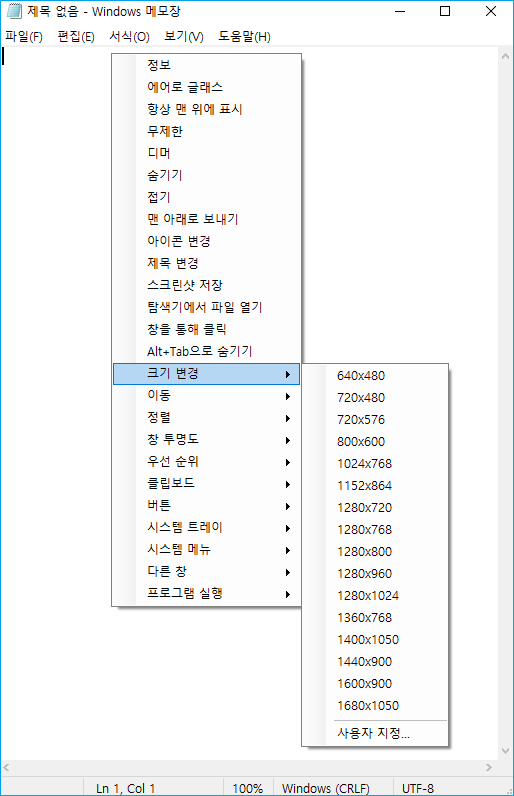
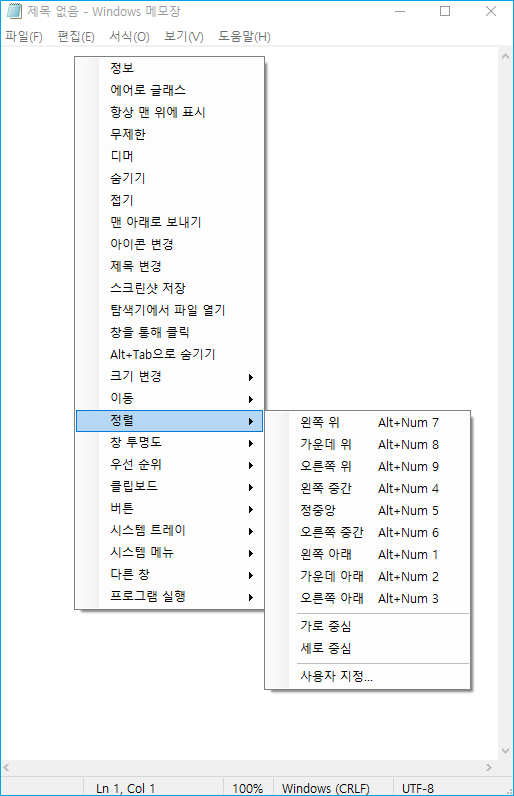
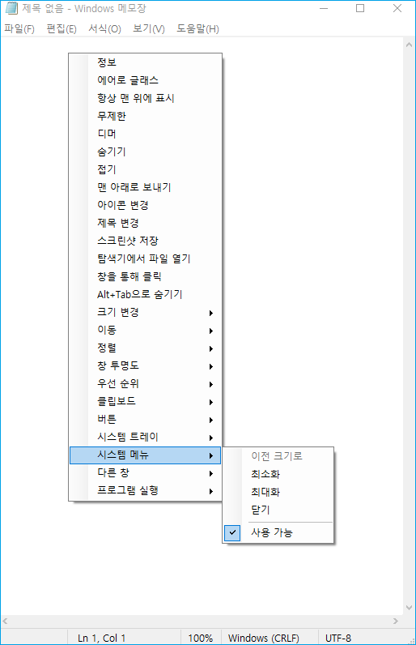

<div align="center">


# SmartContextMenu

</div>

🌏: [English](/) [Русский](/README_RU.md) [中文版](/README_CN.md) [**한국어**](/README_KO.md)

---

SmartContextMenu는 시스템의 모든 창에 컨텍스트 메뉴를 추가합니다. 
이 프로그램은 [SmartSystemMenu](https://github.com/AlexanderPro/SmartSystemMenu)의 향상된 버전입니다.
시스템 메뉴가 없는 창을 포함하여 모든 유형의 창을 지원하므로 더욱 편리해지기를 바랍니다.
또한 별도의 DLL 모듈에 있는 후크를 사용하지 않으므로 안정성과 가벼움이 더욱 뛰어납니다.
앱을 사용하려면 SmartContextMenu.exe 파일을 실행하고 마우스 커서를 원하는 창으로 이동한 후 단축키 “**Ctrl + 오른쪽 마우스 버튼**”을 사용하세요.
모든 메뉴 설정과 단축키는 시스템 트레이의 설정 대화상자와 SmartContextMenu.xml 파일에서 변경할 수 있습니다.
사용 가능한 메뉴 항목:

* **정보.** 현재 창과 프로세스에 대한 정보 (창 핸들, 창 캡션, 창 스타일, 창 클래스, 프로세스 이름, 프로세스 ID, 프로세스 경로)가 있는 대화 상자를 표시합니다.
* **에어로 글래스.** 현재 창에 "에어로 글래스" 흐림 효과를 추가할 수 있습니다. (Windows Vista 이상. 주로 콘솔 창에 사용됨)
* **항상 맨 위에.** 현재 창을 다른 모든 창 위에 고정시킵니다.
* **테두리 없음.** 창으로 실행되는 게임을 "테두리 없음" 모드로 전환합니다.
* **어둡게.** 현재 초점이 있는 창을 제외한 모든 창을 어둡게 합니다.
* **숨기기.** 현재 창을 숨길 수 있습니다.
* **롤업.** 현재 창을 말아 올리거나 내릴 수 있습니다.
* **아래로 보내기.** 현재 창을 아래로 보낼 수 있습니다.
* **아이콘 변경.** 현재 창의 아이콘을 변경할 수 있습니다.
* **제목 변경.** 제목 표시줄의 텍스트를 변경할 수 있습니다.
* **스크린샷 저장.** 현재 창의 스크린샷을 파일에 저장할 수 있습니다.
* **탐색기에서 파일 열기.** 파일 탐색기에서 프로세스 파일을 열 수 있습니다.
* **클릭 통과.** 현재 창을 통과하여 클릭할 수 있게 합니다.
* **Alt+Tab 숨기기.** 작업 표시줄 및 Alt+Tab 전환 시 현재 창을 숨깁니다
* **크기 조정.** 현재 창의 크기를 변경할 수 있습니다.
* **이동.** 현재 창을 다른 모니터로 이동할 수 있습니다.
* **정렬.** 현재 창을 바탕 화면의 9개 위치 중 원하는 위치에 맞출 수 있습니다.
* **투명도.** 현재 창의 투명도를 변경할 수 있습니다.
* **우선순위.** 현재 창의 프로그램 우선 순위를 변경할 수 있습니다.
* **클립보드.** 모든 창 텍스트 (콘솔, MS 오피스 제품 등 포함)를 클립보드에 복사하고 클립보드를 지울 수 있습니다.
* **버튼.** "최소화", "최대화" 및 "닫기" 버튼을 비활성화할 수 있습니다.
* **시스템 트레이.** 현재 창을 최소화하거나 시스템 트레이에 일시 중지할 수 있습니다.
* **시스템 메뉴.** 시스템 메뉴 항목을 포함합니다.
* **기타 창.** 현재 창을 제외한 시스템의 모든 창을 닫고 최소화할 수 있습니다.
* **시작 프로그램.** 설정에서 프로그램을 시작할 수 있습니다.

스크린샷
------------------





명령줄 인터페이스
--------------------

```bash
   --help             도움말
   --title            제목
   --titleBegins      제목 시작
   --titleEnds        제목 끝
   --titleContains    제목 포함
   --handle           핸들 (1234567890) (0xFFFFFF)
   --processId        PID (1234567890)
-d --delay            지연 시간 (밀리초)
-l --left             왼쪽
-t --top              위쪽
-w --width            너비
-h --height           높이
-i --information      정보 대화상자
-s --savescreenshot   스크린샷 저장
-m --monitor          [0, 1, 2, 3, ...]
-a --alignment        [왼쪽 위,
                       위 가운데,
                       오른쪽 위,
                       왼쪽 중간,
                       가운데 중간,
                       오른쪽 중간,
                       왼쪽 아래,
                       아래 가운데,
                       오른쪽 아래,
                       가로 중심,
                       세로 중심]
-p --priority         [실시간,
                       높음,
                       정상 이상,
                       정상,
                       정상 이하,
                       유휴]
   --systemmenu       [복원,
                       최소화,
                       최대화,
                       닫기]
   --transparency     [0 ... 100]
   --alwaysontop      [켜기, 끄기]
-g --aeroglass        [켜기, 끄기]
   --hide             [켜기, 끄기]
   --hidealttab       [켜기, 끄기]
   --clickthrough     [켜기, 끄기]
   --minimizebutton   [켜기, 끄기]
   --maximizebutton   [켜기, 끄기]
   --sendtobottom     맨 아래로 보내기
-b --borderless       테두리 없음
-r --rollup           롤업
-o --openinexplorer   탐색기에서 파일 열기
-c --copytoclipboard  창 텍스트를 클립보드에 복사
   --copyscreenshot   스크린샷을 클립보드에 복사
   --clearclipboard   클립보드 지우기
-n --nogui            GUI 없음

예:
SmartContextMenu.exe --title "Untitled - Notepad" -a topleft -p high --alwaysontop on --nogui
```

설치
--------------------

* zip 파일에서 [SmartContextMenu](https://github.com/AlexanderPro/SmartContextMenu/releases) 다운로드
* [Chocolatey](https://chocolatey.org/): `choco install smartcontextmenu`
* [Scoop](https://scoop.sh/): `scoop bucket add extras` 및 `scoop install extras/smartcontextmenu`

요구 사항
--------------------

* OS Windows XP SP3 이상. x86 및 x64 시스템을 지원합니다.
* .NET Framework 4.0

파일
--------------------

* SmartContextMenu.exe
* SmartContextMenu.xml (roaming 사용자 디렉터리에 저장됩니다. SmartContextMenu를 포터블 앱으로 사용하려면 SmartContextMenu.exe 파일이 있는 디렉터리에 파일을 복사하세요.)
